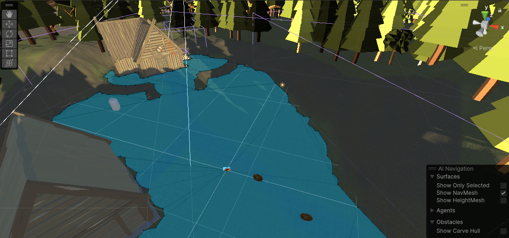
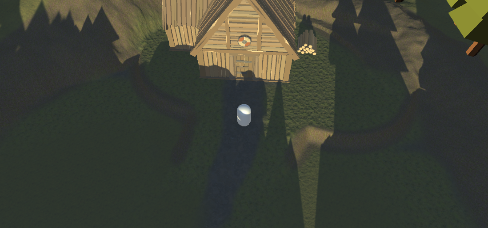

# Unity Terrain and NavMesh Demo

This is a class example project that demonstrates Terrain, NavMesh, and Cinemachine. This project also makes use of [Naughty Attributes](https://github.com/dbrizov/NaughtyAttributes). The capsule navigates to where you click and you can collect coins.

## Structure

* `3rd Party` - Third party assets and scripts 
* `Prefabs` - Prefabs used in any scene
* `Scenes` - A folder for each scene containing the scene and scene-specific assets
* `Scripts` - Scripts for this demo

This was created with Unity Version 2022.3.4f1. There have been significant changes to Cinemachine in Unity 6 so it may not upgrade cleanly.

